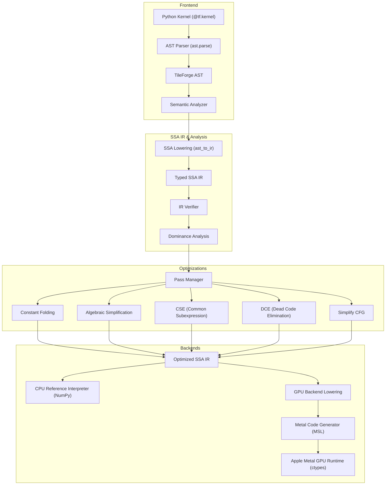

# TileForge Compiler Architecture

TileForge is an educational and research tensor-kernel compiler designed from scratch to study blocked programming models, static typing, SSA intermediate representations (IR), compiler transformations, and Metal GPU backend lowering.

## Pipeline Architecture

## Key Stages

1. **Frontend (`tileforge/frontend/`)**: AST parsing, kernel parameter validation, diagnostic error reporting.
2. **Type System (`tileforge/ir/types.py`)**: Strict primitive scalars (`f32`, `i32`, `i64`, `bool`), typed pointers (`ptr<T>`), and tensors (`tensor<shape x T>`).
3. **Typed SSA IR (`tileforge/ir/`)**: Basic blocks, phi nodes / branch parameters, dominator tree analysis, and strict SSA verifier.
4. **Transformations (`tileforge/passes/`)**: Canonicalization, constant folding, algebraic simplification, Value-numbering CSE, and dead-code elimination.
5. **Backends**:
   - **CPU Reference Interpreter (`tileforge/runtime/`)**: NumPy-backed reference execution for functional correctness verification.
   - **Metal Backend (`tileforge/backend/metal/`)**: Metal Shading Language (MSL) source generation and native execution via Apple Silicon Metal runtime bridge.
