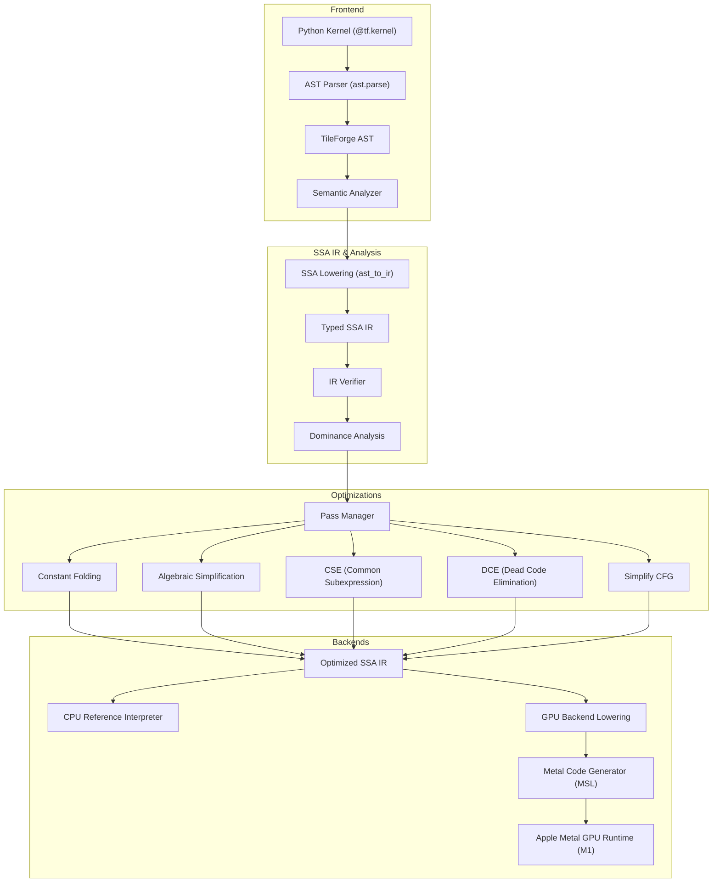

# TileForge

TileForge is an experimental tensor-kernel compiler built from scratch with a Python frontend, typed Static Single Assignment (SSA) Intermediate Representation (IR), compiler optimization passes, and native Apple Metal GPU code generation.

---

## Why TileForge?

TileForge was built as an educational and research project to explore how high-level tensor kernels written in a Python-like blocked programming model can be translated through standard compiler stages (AST parsing, semantic analysis, typed SSA IR, Control Flow Graph dominance analysis, and optimization passes) down to backend code generation and native Metal Shading Language (MSL) execution on Apple Silicon GPUs.

Inspired by systems such as Triton, LLVM/MLIR concepts, SSA compilers, and GPU programming models, TileForge is built entirely from scratch in Python to demystify the internal translation layers of modern domain-specific GPU compilers.

---

## Compiler Pipeline

```text
Python Kernel (@tf.kernel)
     ↓
TileForge AST
     ↓
Semantic Analysis (Type & Symbol Checking)
     ↓
Typed SSA IR (Blocks, Arguments, Values)
     ↓
CFG + Dominance Analysis
     ↓
Optimization Passes (Constant Folding, Algebraic, CSE, DCE)
     ↓
GPU Backend IR
     ↓
Metal Code Generation (Deterministic MSL)
     ↓
Native Apple GPU Execution (ctypes Objective-C Metal Bridge)
```

The compiler also includes a deterministic **CPU Reference Interpreter** powered by NumPy, which serves as a correctness oracle for verifying GPU kernel execution against the high-level SSA IR.

---

## Architecture



---

## Core Systems

### Python Frontend
- **Restricted Python Syntax**: Accepts Python function definitions decorated with `@tf.kernel`. Rejects unsupported constructs (classes, arbitrary imports, dynamic eval) at compile time.
- **Kernel Decorator**: Enforces function parameter validation and provides compiler entry points.
- **AST Parsing**: Parses Python source via `ast.parse` into a custom **TileForge AST** retaining exact source line and column locations for diagnostics.
- **Diagnostics**: Produces clear compilation errors for undefined symbols, type mismatches, and unsupported AST nodes.

### Type System
- **Scalar Primitive Types**: `i1` (bool), `i32`, `i64`, `f32`.
- **Pointer Types**: `ptr<T>` (e.g., `ptr<f32>`) representing device memory allocations.
- **Tensor Block Types**: `tensor<shape x element_type>` (e.g., `tensor<256xf32>`, `tensor<16x16xf32>`) representing blocked register tiles.
- **Static Checking**: Enforces scalar/tensor type matching and static shape compatibility during semantic analysis.

### SSA IR & Control Flow Graph (CFG)
- **Core Entities**: `Module`, `Function`, `Block`, `Operation`, `Value`, `Use`.
- **Block Arguments**: Implements explicit block arguments for SSA values across basic block boundaries (`^loop_header(%arg0: i32)`).
- **Multi-Block CFG**: Represents arbitrary structured loops and conditional branching via explicit branch operations (`tf.br`, `tf.cond_br`).

### Compiler Analysis
- **CFG Analysis**: Computes basic block predecessors, successors, and reachability.
- **Dominance Analysis**: Implements `DominanceInfo` to compute immediate dominators, dominance frontiers, and dominance trees across multi-block CFGs.
- **SSA Verification**: Validates that all operand uses are strictly dominated by their definitions and that block argument counts and types match across branch targets.

### Optimization Passes
- **Constant Folding**: Folds compile-time literal arithmetic (`16 * 16 -> 256`) and comparison operations.
- **Algebraic Simplification**: Simplifies identity expressions (e.g., `x + 0 -> x`, `x * 1 -> x`, `x * 0 -> 0`).
- **Common Subexpression Elimination (CSE)**: Eliminates redundant side-effect-free operations within basic blocks.
- **Dead Code Elimination (DCE)**: Removes unused pure operations whose results do not contribute to side-effecting operations (`tf.store`, `tf.return`).
- **Simplify CFG**: Folds constant branch conditions (`tf.cond_br true, ^then, ^else`) and eliminates unreachable basic blocks.

### CPU Reference Interpreter
- Serves as the primary correctness oracle before GPU code generation.
- Executes high-level TileForge SSA IR sequentially using NumPy buffers, validating masked loads, masked stores, and block iteration math.

### GPU Backend IR
- Intermediate translation layer between high-level TileForge SSA IR and Metal code generation.
- Maps block operations into lane-level thread indexing (`GPUOpType.PROGRAM_ID`, `GPUOpType.THREAD_ID`, `GPUOpType.GLOBAL_LOAD`, `GPUOpType.GLOBAL_STORE`, `GPUOpType.TILED_DOT`, `GPUOpType.TILED_STORE`).

### Native Metal Backend
- **Deterministic MSL Generator**: Translates GPU Backend IR into readable, standards-compliant C++14 Metal Shading Language (MSL).
- **CFG Control Flow State Machine**: Lowers multi-block basic branches and loops into structured C++ `switch (_state)` loops, bypassing MSL label constraints.
- **Runtime Bridge**: Connects directly to Apple Metal via an Objective-C `ctypes` FFI bridge (`MTLDevice`, `MTLCommandQueue`, `MTLBuffer`, `MTLComputePipelineState`), compiling MSL source at runtime and executing kernels directly on the Apple M1 GPU.

### Reductions
- **Threadgroup Reductions**: Implements `tf.sum` and `tf.max` via 256-thread shared memory tree reduction (`threadgroup_barrier(mem_flags::mem_threadgroup)`).
- **Multi-Stage Global Aggregation**: Combines local threadgroup reductions with multi-pass global grid launches for full array reductions.

### Threadgroup-Tiled GEMM
- **Tiled Execution**: Lowers matrix multiplication (`tf.dot`) into 2D threadgroup-tiled execution ($BM=16, BN=16, BK=16$).
- **Shared Memory Allocation**: Allocates local threadgroup tiles `tileA[16][16]` and `tileB[16][16]`.
- **Cooperative Loading & Barriers**: Threads cooperatively load matrix tiles from global memory into shared memory, synchronized with `threadgroup_barrier`.
- **Edge Masking**: Safely handles non-divisible matrix dimensions ($M, N, K$) via boundary predicate guards.
- **Operation-by-Operation Lowering**: Fully integrated into the backend IR state machine generator (`GPUOpType.TILED_DOT` and `GPUOpType.TILED_STORE`) without relying on whole-function code templates.

---

## Code Example & Compilation Pipeline

### 1. Python Source Kernel
```python
@tf.kernel
def add(x, y, out, n):
    pid = tf.program_id(0)
    offsets = pid * 256 + tf.arange(0, 256)
    mask = offsets < n
    a = tf.load(x, offsets, mask)
    b = tf.load(y, offsets, mask)
    tf.store(out, offsets, a + b, mask)
```

### 2. High-Level TileForge SSA IR
```text
func @add(%x: ptr<f32>, %y: ptr<f32>, %out: ptr<f32>, %n: i32) {
^entry:
  %0 = tf.program_id axis=0 : i32
  %1 = tf.constant 256 : i32
  %2 = tf.mul %0, %1 : i32
  %3 = tf.arange 0, 256 : tensor<256xi32>
  %4 = tf.add %2, %3 : tensor<256xi32>
  %5 = tf.cmp lt %4, %n : tensor<256xi1>
  %6 = tf.load %x[%4], mask=%5 : tensor<256xf32>
  %7 = tf.load %y[%4], mask=%5 : tensor<256xf32>
  %8 = tf.add %6, %7 : tensor<256xf32>
  tf.store %out[%4], %8, mask=%5
  tf.return
}
```

### 3. Generated Metal Shading Language (MSL) Excerpt
```cpp
#include <metal_stdlib>
using namespace metal;

kernel void add(
    device float* var_x [[buffer(0)]],
    device float* var_y [[buffer(1)]],
    device float* var_out [[buffer(2)]],
    constant int& var_n [[buffer(3)]],
    uint3 tid [[thread_position_in_threadgroup]],
    uint3 tgid [[threadgroup_position_in_grid]]
) {
    int pid0 = (int)tgid.x;
    int offs = pid0 * 256 + (int)tid.x;
    bool mask = (offs < var_n);
    float a = mask ? var_x[offs] : 0.0f;
    float b = mask ? var_y[offs] : 0.0f;
    if (mask) { var_out[offs] = a + b; }
}
```

---

## Testing & Verification

The test suite covers frontend parsing, semantic analysis, static typing, SSA/IR verification, dominance analysis, optimization passes, CPU reference interpreter, GPU backend IR, MSL code generation, native Metal execution, multi-stage reductions, and threadgroup-tiled GEMM.

Run the full test suite via pytest:

```bash
pytest --collect-only -q
pytest -v
```

**Verified Test Results**:
- **Collected**: 61 tests
- **Passed**: 61 / 61 tests (0 failures, 0 skipped)

---

## Correctness

Kernel execution correctness is verified against NumPy across CPU and GPU backends:

- **Vector Addition**: Verified for exact numerical correctness across vector lengths $N \in \{1, 17, 255, 256, 257, 1000, 4097\}$.
- **Reductions**: Verified against `np.sum` and `np.max` within standard single-precision floating point accumulation tolerance ($rtol=10^{-5}, atol=10^{-5}$).
- **Threadgroup-Tiled GEMM**: Verified against `np.matmul` across representative matrix shapes within floating point tolerance ($rtol=10^{-4}, atol=10^{-4}$):
  - $1 \times 1 \text{ @ } 1 \times 1$
  - $8 \times 8 \text{ @ } 8 \times 8$
  - $16 \times 16 \text{ @ } 16 \times 16$
  - $17 \times 17 \text{ @ } 17 \times 17$ (odd / non-tiled dimension)
  - $31 \times 19 \text{ @ } 19 \times 23$ (non-square rectangular matrix)
  - $65 \times 33 \text{ @ } 33 \times 71$ (non-divisible odd matrix)
  - $64 \times 64$, $128 \times 128$, $257 \times 129 \text{ @ } 129 \times 193$

---

## Benchmark & Performance Analysis

Performance benchmarks measured on an **Apple M1 GPU** (Darwin 24.5.0, Python 3.14) compare NumPy CPU compute time against TileForge Metal GPU execution times.

### Tiled Matrix Multiplication Benchmark Summary (`benchmarks/results/tiled_matmul_benchmark.json`)

| Matrix Size ($M=N=K$) | NumPy CPU Mean (ms) | Metal GPU Kernel Only Mean (ms) | Metal End-to-End Mean (ms) |
|:---:|:---:|:---:|:---:|
| $64 \times 64$ | 0.0018 ms | 0.0205 ms | 0.2799 ms |
| $128 \times 128$ | 0.0054 ms | 0.0768 ms | 0.3729 ms |
| $256 \times 256$ | 0.0310 ms | 0.4662 ms | 0.8818 ms |
| $512 \times 512$ | 0.2252 ms | 1.1583 ms | 4.0398 ms |

### Architectural Analysis & Honest Performance Note
For small and medium matrix multiplication shapes, NumPy (which links directly to Apple Accelerate / BLAS optimized CPU assembly) executes faster than TileForge's baseline threadgroup-tiled GPU kernel.

TileForge prioritizes clean compiler architecture, explicit SSA IR lowering, and numerical correctness over aggressive hardware-specific autotuning or SIMD matrix assembly. End-to-end times also reflect host-to-device buffer allocations and FFI sync overheads inherent in experimental runtime drivers.

---

## Project Limitations

- **Educational & Research Scope**: TileForge is an experimental compiler prototype and is not intended as a production replacement for Triton, PyTorch, or vendor BLAS libraries.
- **Target Backend**: Supports Apple Metal (MSL) and CPU NumPy reference backends. No CUDA, ROCm, Triton, or LLVM/MLIR target generation.
- **Data Type Coverage**: Currently focused on `f32`, `i32`, `i1`, `i64`. No float16/bfloat16 GPU hardware packing.
- **GEMM Strategy**: Uses a baseline $16 \times 16$ threadgroup shared-memory tiling model. Does not implement SIMDgroup matrix instructions (`simdgroup_matrix`), warp-level register tiling, or dynamic autotuning.
- **Language Syntax**: Restricts Python syntax to blocked kernel patterns. Arbitrary Python code inside kernels is intentionally rejected.

---

## Repository Structure

```text
tileforge/
  frontend/          # Python AST parsing, symbol resolution, semantic analysis
  ir/                # Typed SSA IR (Value, Block, Operation, Function, Module, Types)
  lowering/          # Python AST to SSA IR lowering
  passes/            # Optimization passes (Constant folding, Algebraic, CSE, DCE, SimplifyCFG)
  runtime/           # CPU reference interpreter (NumPy execution)
  backend/
    metal/           # Metal Backend IR, MSL Code Generator, FFI Runtime Bridge

tests/               # Unit, integration, snapshot, and end-to-end pytest suite
examples/            # Executable kernel examples (Vector add, Matmul)
benchmarks/          # Performance benchmarks & JSON result logs
docs/                # In-depth compiler design documentation
artifacts/generated/ # Sample compiler-generated Metal MSL source files
```

---

## Quick Start

### Installation

Clone the repository and install in editable mode:

```bash
git clone https://github.com/vermasarthak/tileforge.git
cd tileforge
python3 -m venv .venv
source .venv/bin/activate
pip install -e .
```

### Running Tests

```bash
pytest --collect-only -q
pytest -v
```

### Running Examples

Run the vector addition demo (compiles to Metal and verifies against NumPy):

```bash
python3 examples/vector_add.py
```

Run the tiled matrix multiplication demo:

```bash
python3 examples/matmul.py
```

Run the command-line interface (CLI):

```bash
tileforge --help
```

---

## License

This project is licensed under the MIT License - see the [LICENSE](LICENSE) file for details.
