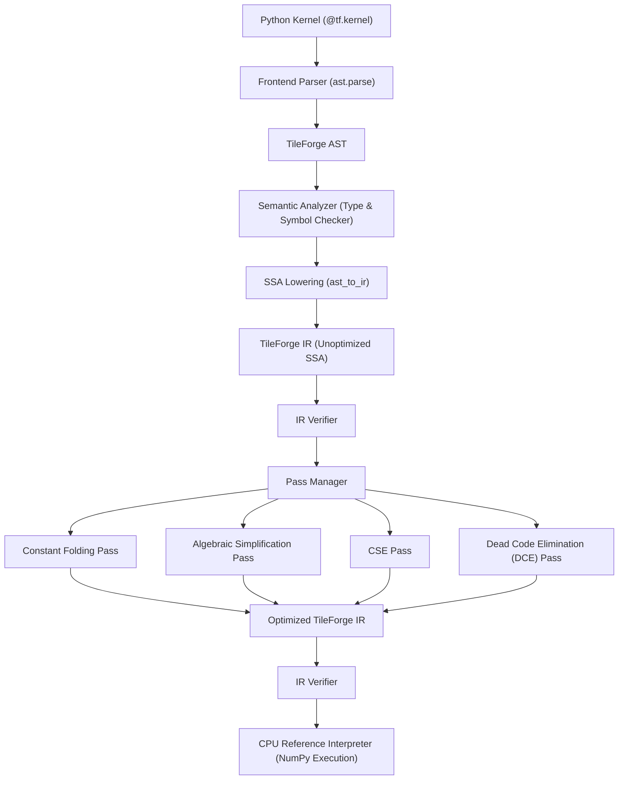

# TileForge Compiler Architecture

TileForge is an original, educational/research tensor-kernel compiler designed from scratch to study blocked programming models, static typing, SSA-based intermediate representations (IR), optimization transformations, and reference execution models.

## Compiler Pipeline

## Key Compiler Stages

1. **Frontend (`tileforge/frontend/`)**:
   - Accepts Python source code for decorated `@tf.kernel` functions.
   - Parses Python source into standard Python AST.
   - Validates that only allowed constructs are present (strictly prohibiting arbitrary Python constructs/eval).
   - Converts Python AST into custom **TileForge AST** retaining line/column source locations.
   - Performs **Semantic Analysis**: checks symbol scopes, checks builtins, resolves types, checks pointer/tensor types, and validates shape compatibility.

2. **Type System (`tileforge/ir/types.py`)**:
   - Primitive Scalar Types: `i1`, `i8`, `i16`, `i32`, `i64`, `f16`, `bf16`, `f32`, `f64`.
   - Pointer Types: `ptr<T>` (e.g. `ptr<f32>`).
   - Tensor Block Types: `tensor<shape x element_type>` (e.g. `tensor<256xf32>`).
   - Void Type: `void`.

3. **Intermediate Representation (`tileforge/ir/`)**:
   - Custom SSA (Static Single Assignment) IR.
   - Core constructs: `Value`, `Operation`, `Block`, `Function`, `Module`, `Type`.
   - Centralized Operations (`tf.constant`, `tf.add`, `tf.sub`, `tf.mul`, `tf.div`, `tf.cmp`, `tf.program_id`, `tf.arange`, `tf.load`, `tf.store`, `tf.return`, `tf.where`).
   - Deterministic textual printer.
   - Strict IR verifier enforcing SSA invariants, type matching, and block parent links.

4. **Lowering (`tileforge/lowering/ast_to_ir.py`)**:
   - Lowers high-level TileForge AST into SSA IR.
   - Handles variable reassignment by assigning new SSA values while tracking symbol bindings.

5. **Optimization Passes (`tileforge/passes/`)**:
   - `PassManager`: Pipeline execution with pre/post IR verification.
   - `ConstantFoldPass`: Folds compile-time literal arithmetic and comparisons.
   - `AlgebraicSimplifyPass`: Applies algebraic identities (e.g., `x + 0 -> x`, `x * 1 -> x`, `x * 0 -> 0`).
   - `CSEPass`: Common subexpression elimination for pure side-effect-free ops.
   - `DeadCodeEliminationPass`: Removes dead operations that do not contribute to side-effects (e.g. store/return preserved).

6. **Runtime / Interpreter (`tileforge/runtime/interpreter.py`)**:
   - Reference CPU interpreter using NumPy for block memory execution.
   - Simulates block program grid execution across `program_id` axes.
   - Enforces masked load and masked store semantics.
